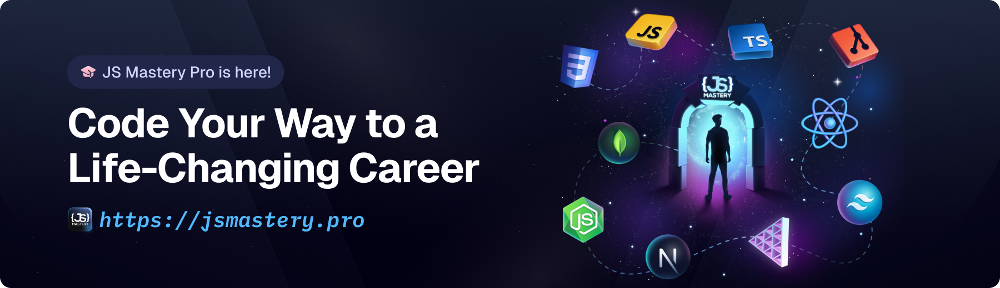

<div align="center">
  

  <h1 align="center">✨ Interactive 3D Developer Portfolio ✨</h1>

  <p align="center">
    <strong>An immersive, GSAP-animated, 3D WebGL developer portfolio.</strong>
    <br />
    <br />
    <a href="#-quick-start">Quick Start</a>
    ·
    <a href="#-features">Features</a>
    ·
    <a href="#%EF%B8%8F-tech-stack">Tech Stack</a>
    ·
    <a href="#-contact">Contact</a>
  </p>
  
  <p align="center">
    <!-- Badges -->
    
    
    
    
    
  </p>
</div>

---

<details>
<summary>📖 <strong>Table of Contents</strong> (Click to expand)</summary>

1. [🌟 About the Project](#-about-the-project)
2. [🚀 Features](#-features)
3. [⚙️ Tech Stack & Architecture](#%EF%B8%8F-tech-stack--architecture)
4. [🛠️ Quick Start (Local Setup)](#-quick-start-local-setup)
5. [💡 Performance & Optimizations](#-performance--optimizations)
6. [📬 Contact](#-contact)

</details>

---

## 🌟 About the Project

This project is a deeply interactive, 3D web-based developer portfolio. Moving far beyond statically generated websites, this portfolio leverages **React Three Fiber** for seamless WebGL 3D implementations while relying on **GSAP ScrollTrigger** for ultra-smooth transition and parallax scroll events. 

It tracks my journey as a developer, highlighting my projects, experience, educational timeline, and technical toolkit.

[](https://github.com/krrobincook/personal-portfolio)

---

## 🚀 Features

- 🧊 **Immersive 3D Experiences:** Smoothly rotating and fully intractable WebGL 3D models imported and optimized using `@react-three/drei` and `Three.js`.
- 🪄 **Buttery Smooth Scroll Animations:** Scroll-hijack-free animations tied deeply to scroll layout positions using GSAP.
- ✨ **Custom Interactive UI/UX:** Features dynamic hover effects, glowing tech stacks, and custom-styled aesthetic blocks built using Tailwind CSS v4.
- ⚡ **Extreme Performance Optimization:** Utilizes `will-change: transform`, optimized shaders, compressed 3D GLB models, and reduced CSS DOM thrashing (such as removing fixed attachments over blur filters) to keep the app rendering at 60fps across mobile and desktop.
- 📬 **Serverless Email Forms:** Integrated direct-to-inbox messaging using `EmailJS` natively within the Contact component. 
- 📱 **Fully Responsive Layouts:** Carefully crafted to snap properly across all viewport bounds.

---

## ⚙️ Tech Stack & Architecture

### **Core Libraries**
| Technology | Usage |
| :--- | :--- |
| **[React 19](https://react.dev/)** | Core UI component ecosystem |
| **[Vite](https://vitejs.dev/)** | Next-generation frontend build tooling |
| **[Tailwind CSS v4](https://tailwindcss.com/)** | Rapid UI and responsive styling system |

### **3D Graphics & Animations**
| Technology | Usage |
| :--- | :--- |
| **[Three.js](https://threejs.org/) & [R3F](https://docs.pmnd.rs/react-three-fiber)** | Low-level WebGL API and React renderer |
| **[@react-three/drei](https://github.com/pmndrs/drei)** | Helpful abstractions for 3D components |
| **[GSAP](https://gsap.com/) & ScrollTrigger** | High-performance Javascript animations |

---

## 🛠️ Quick Start (Local Setup)

To run this project locally, simply follow these steps.

### 1️⃣ Clone the Repo
```bash
git clone https://github.com/krrobincook/personal-portfolio.git
cd personal-portfolio
```

### 2️⃣ Install Dependencies
Ensure you have `Node.js` installed, then run:
```bash
npm install
```

### 3️⃣ Configure Environment Variables
You'll need an active [EmailJS](https://www.emailjs.com/) account for the contact form to work properly. Create a file named `.env.local` in the project root:

```env
VITE_APP_EMAILJS_SERVICE_ID="YOUR_SERVICE_ID"
VITE_APP_EMAILJS_TEMPLATE_ID="YOUR_TEMPLATE_ID"
VITE_APP_EMAILJS_PUBLIC_KEY="YOUR_PUBLIC_KEY"
```

### 4️⃣ Start the Dev Server
```bash
npm run dev
```
Open `http://localhost:5173` in your browser to view the portfolio!

---

## 💡 Performance & Optimizations

If you are cloning this to use as a baseline, take note of performance tweaks applied here:
- Use of `.glb` models dramatically decreases payload size.
- Using native CSS `transform` over absolute layout shifts and ensuring 3D Canvases use `Suspense` placeholders.
- Stripping heavy `filter: blur()` calculations from animated objects and removing `background-attachment: fixed` on masked gradients to guarantee high FPS in the **Tech Stack** and **Journey** components.

---

## 📬 Contact

**Kumar Robin Cook**

- **LinkedIn:** [krrobincook](https://www.linkedin.com/in/kumarrobincook/)
- **GitHub:** [@krrobincook](https://github.com/krrobincook)

---
<div align="center">
  <sub>Built with ❤️ and React Three Fiber. If you like it, consider leaving a ⭐!</sub>
</div>
